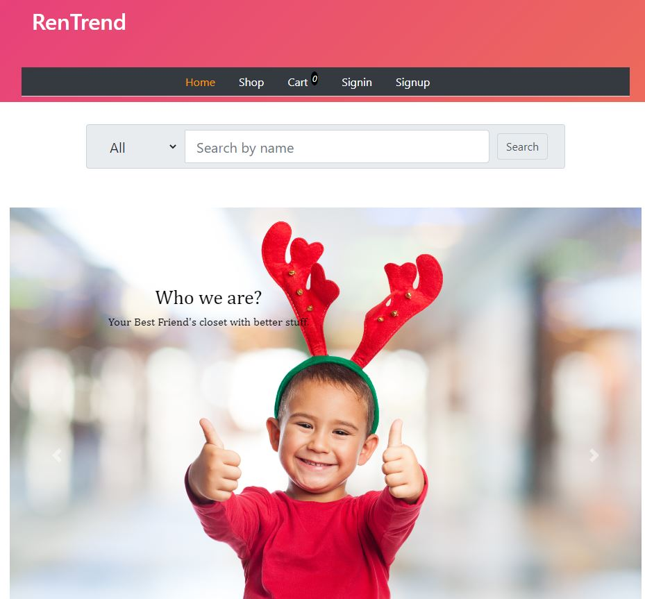

# Project Name : RenTrend
This is a student project during academic year 2020

An e-commerce web application using MERN Technologies.

Deployed live in : https://rentrend-marl-squirrel.herokuapp.com/



## Team Name : Squirrel Tech
## Team Members
* Amit Deka
* Krishna Dipakkumar Shah
* Krishna Monik Patel
* Marl Dohn Mazo
* Shikha Goyal
* Sukhdeep Kaur Sandhu


## Technology
### MERN 
* MongoDB, Express, React, NodeJS


## Development

### Getting Started
You should install all dependencies on both front end and back end.
To do this, **you need to be on the Back end folder and Front End folder** and type this command:

 ``` cmd
         npm install
 ```
You are going to do this twice.

### Running the Application
You should Run the backend and the front end at the same time. The group did not create a short-cut script to run both at the same time so you will need to go to the specific folder and run each by doing
 ``` cmd
         npm start
 ```
Remember that **you should run do this twice on both Back end folder and Front End folder**
